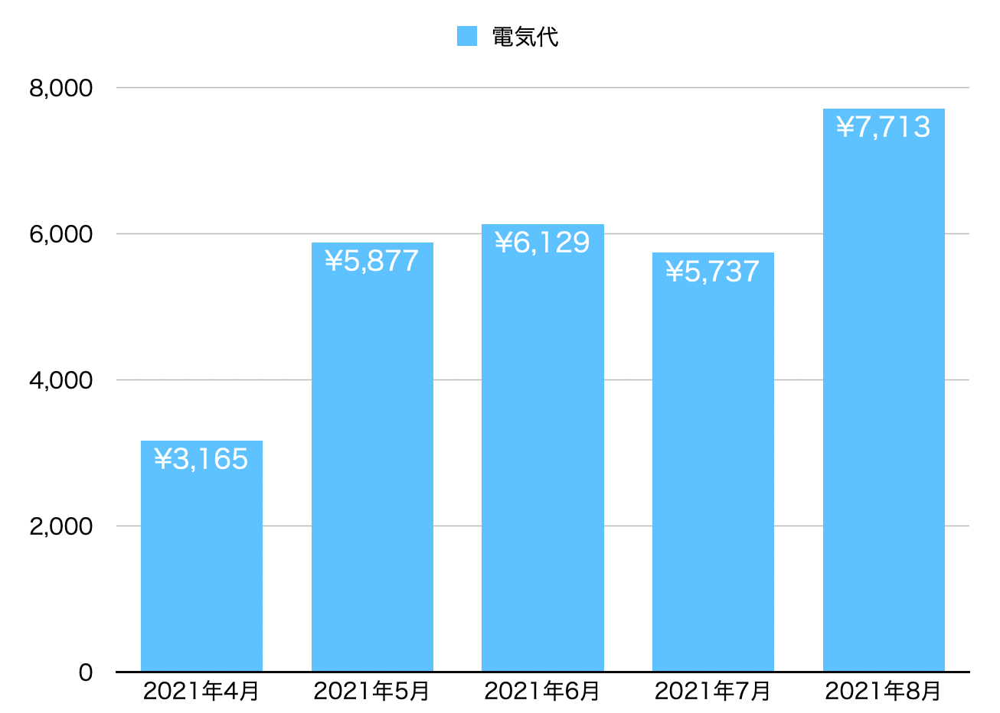

# 目的

家庭内の電気代を最適化するための戦略立案

# 背景と課題

電気代が増加傾向にある（下図）
しかし、どこでいつお金がかかっているかわからないので、どうすれば電気代を削減できるのか戦略を立てることが難しい。

# 方針

電力会社のデータでは、家全体の電流量データしか取れないため、電気代削減に対する具体的な戦略が立てられない。
なのでまずは電流センサーを用いて、消費電力が大きいとされる家電(*1)の電力使用状況を分析する。

|優先順位|家電|
|:-:|:--|
|１|電気冷蔵庫|
|２|エアコン|
|３|照明器具|
|４|ディスプレイ|

(*1)[電気代のかかる家電ランキング](https://kakaku.com/energy/article/?en_article=15)

***
以上。