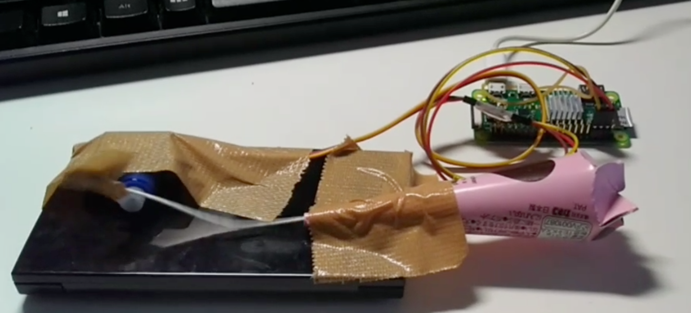
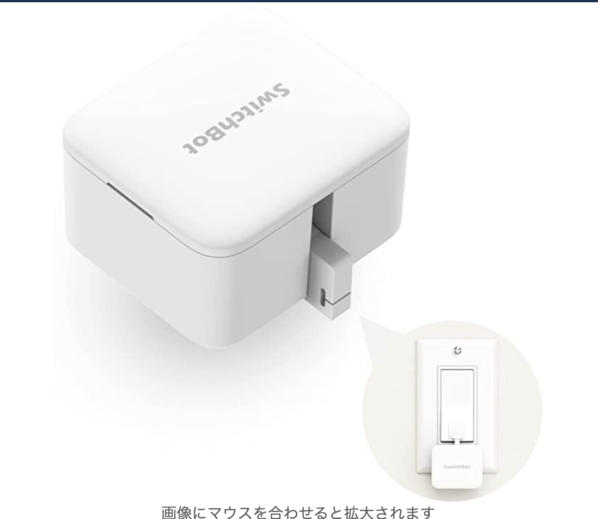
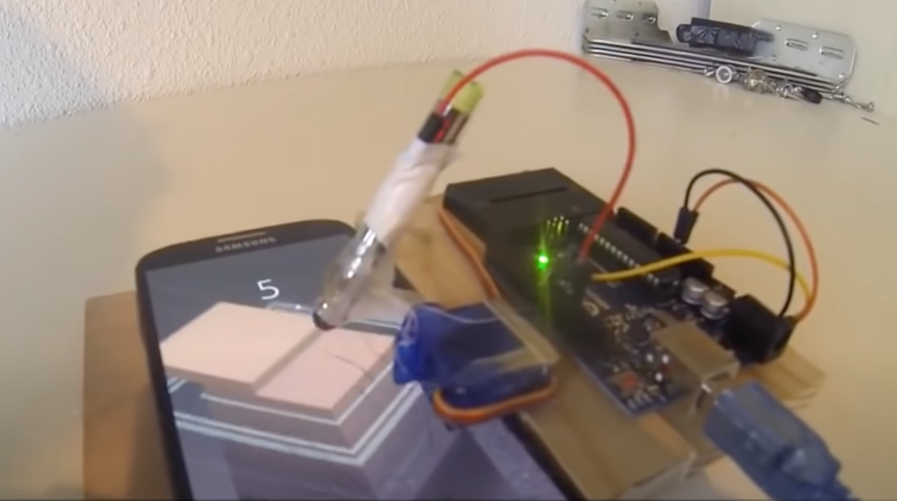
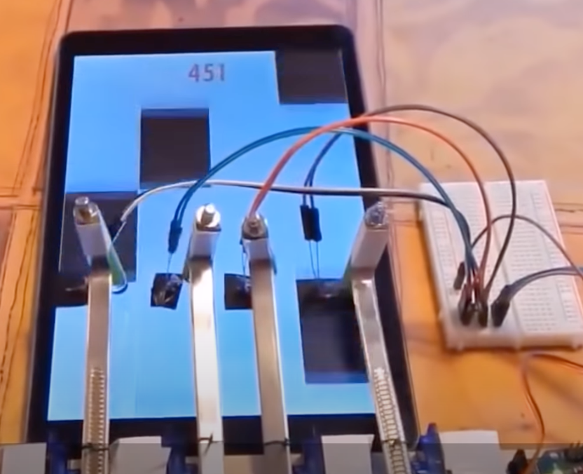
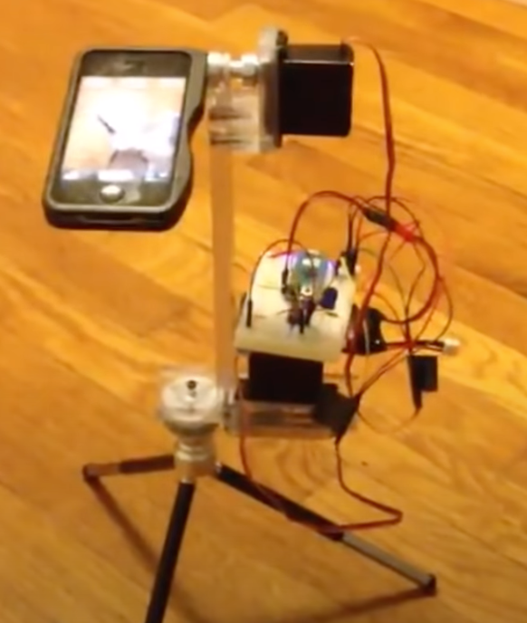
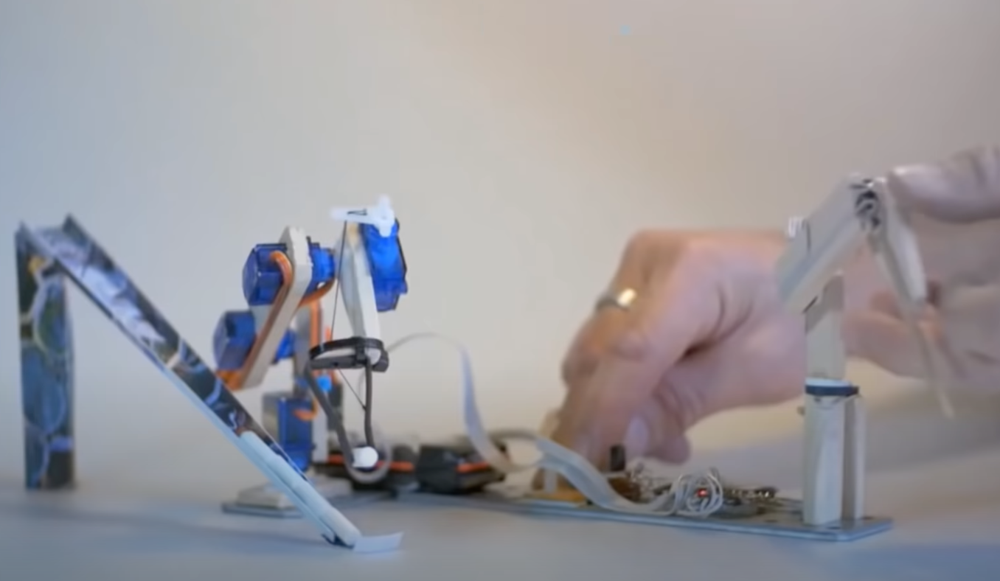
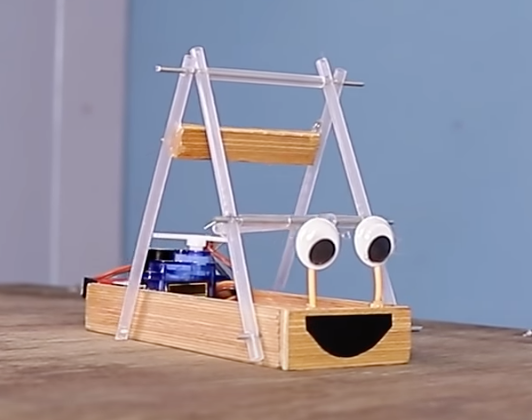
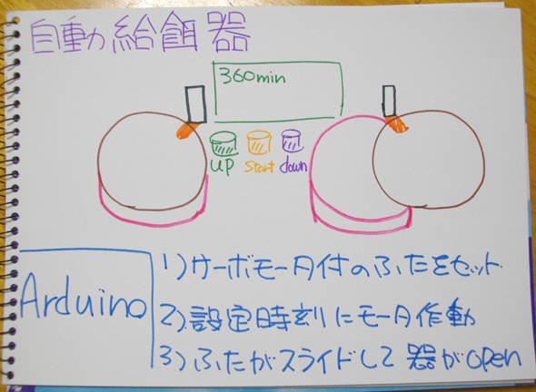

## 目次
```toc
# 目次はここに追加されます。
```

***
***
<br>

## クラッカー操作

クラッカーを引っ張って鳴らす


## スイッチ押してくれるやつ



https://www.amazon.co.jp/dp/B07B7NXV4R/ref=cm_sw_r_tw_dp_dl_9AD1FP9G4XYXDWV2PF3J @amazonJP

## スマホの画面を押し続けるやつ

色々応用できそう


数が増えても使える笑


https://www.youtube.com/watch?v=Ogm3ITBxkL8

スマホ版RPA笑

## 遠隔でカメラを操作

Zoomとかの併用で、より臨場感あるビデオ会議ができそう。


https://www.youtube.com/watch?v=Ogm3ITBxkL8

※パンチルの方がベターかも

## ロボットアーム

遠隔操作できたり、あらかじめ覚えさせた動作を繰り返させたりできる。工夫したいでは、いろいろなことができそう。


https://www.youtube.com/watch?v=Ogm3ITBxkL8

チェスロボットとか


## ヘンテコロボット

サーボで歩くロボット


https://www.youtube.com/watch?v=pK4DxWex9XI

## 自動餌やり機

魚とかに餌をあげるやつ


https://monoist.atmarkit.co.jp/mn/articles/1406/02/news004.html

## 楽器作り

木琴的なやつ


https://deviceplus.jp/hobby/arduino-control-clipmotor-05/

## その他

https://create.arduino.cc/projecthub/projects/tags/servo