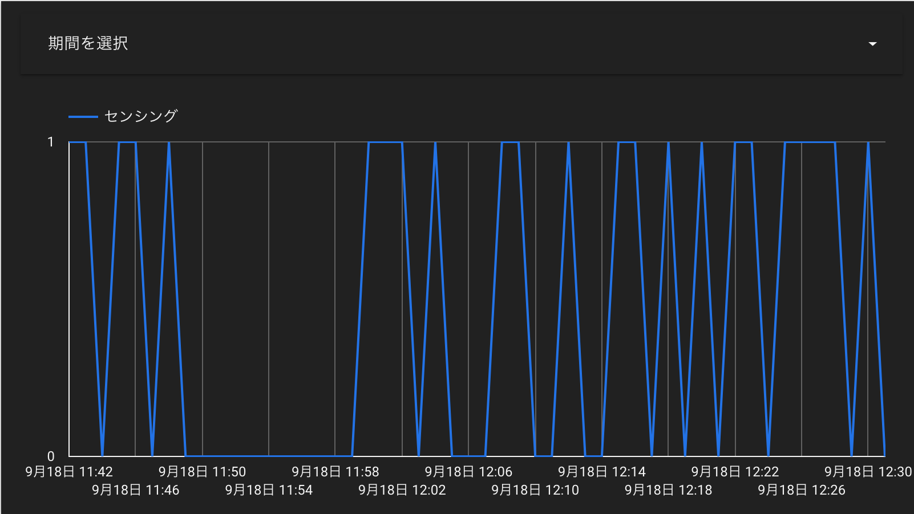

## 目次

```toc
# 目次はここに追加されます。
```

***
<br>

## 準備物

- Rasberry Pi zero WH
- 人感センサ
  焦電型赤外線センサーモジュール SB612A（秋月電子）
- 導線
  メス－メス　３本

## 人感センサの接続

このサイトが参考になる。
https://portaltan.hatenablog.com/entry/2018/05/16/094219


### 接続テスト
スーパーユーザで実行が必要
```Bash
sudo su
sudo echo 18 > /sys/class/gpio/export
sudo echo in > /sys/class/gpio/gpio18/direction
```

catで確認したとき、1なら検知できている。

```Bash
cat /sys/class/gpio/gpio18/value
1
```


## GOOGLE SPREAD SHEET に記録する

### GOOGLE SPREAD SHEET を準備

Spread Sheet のスクリプトエディタで、データを受けてSpread Sheetに書き込むプログラムを作る。
（Google App Script）

```javascript

function doGet(e) {

  //データを受信する（人感センサの状態を受け取る）
  var sensing = e.parameter.sensing;

  //現状Activeになっているsheetを取得
  var sheet = SpreadsheetApp.getActiveSheet();
 
  //現在日時をspreadsheetへ書き込み
  sheet.appendRow([new Date(),sensing]);
}

```

WEBアプリとしてデプロイ

参考サイト
https://monomonotech.jp/kurage/raspberrypi/google_spreadsheet.html


### Raspi側のプログラムを準備

スピンロックで、1秒間隔で実行。
センシング情報に変化があれば、Google App Scriptがhookされる。

```python
#!/usr/bin/env python

import RPi.GPIO as GPIO
import requests
import time

# GAS hook URL
url_1 = 'https://script.google.com/macros/s/AKfycbynSlN9Ms5vSLea_NlNQBZSgNQAraJ2v_U_Q3qJ84Uj3oAePQbdgJ4On_xxJKG0kPsc/exec'+'?sensing=' + "1"
url_0 = 'https://script.google.com/macros/s/AKfycbynSlN9Ms5vSLea_NlNQBZSgNQAraJ2v_U_Q3qJ84Uj3oAePQbdgJ4On_xxJKG0kPsc/exec'+'?sensing=' + "0"

### setup
GPIO.setmode(GPIO.BCM)
GPIO.setup(18, GPIO.IN) # GPIO 18 : human detect sensor

# initialize
if GPIO.input(18):
  requests.get(url_1)
else:
  requests.get(url_0)

while True:
  GPIO.wait_for_edge(18, GPIO.BOTH)
  if GPIO.input(18):
    requests.get(url_1)
  else:
    requests.get(url_0)

    time.sleep(1)

GPIO.cleanup()

```

プログラムは実行し続ける必要があるため、`nohup`で実行。

```Bash
sudo nohup python3 SB612A.py
```

こんな感じで記録される。
|日時|センシング|
|:--|:--|
|2021/09/18 11:42:56|0|
|2021/09/18 11:42:58|1|
|2021/09/18 11:43:02|0|
|2021/09/18 11:43:05|0|
|2021/09/18 11:43:18|1|

参考サイト
https://portaltan.hatenablog.com/entry/2018/05/16/094219
https://qiita.com/DaigoAikawa/items/f7ee74c21640b921a519

## せっかくなので、可視化してみる

Google Data Studioで可視化。
自動更新され記録される。



