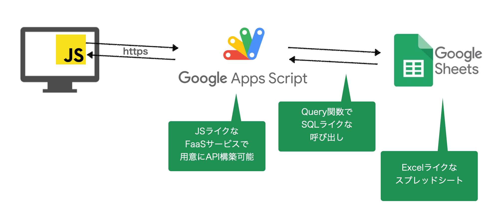
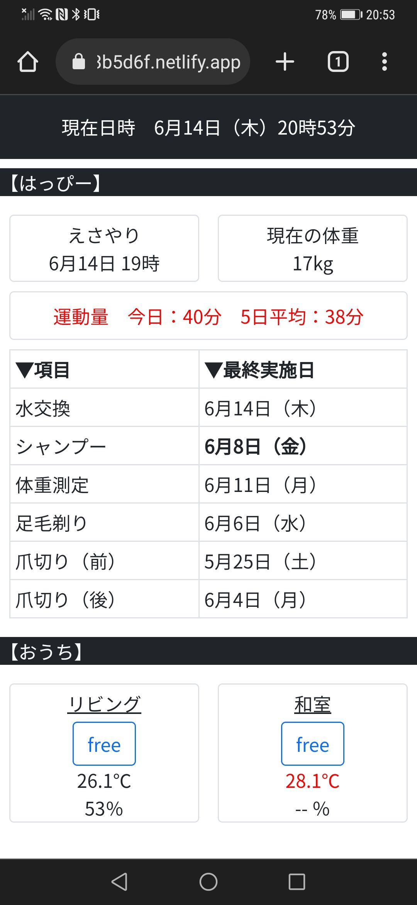
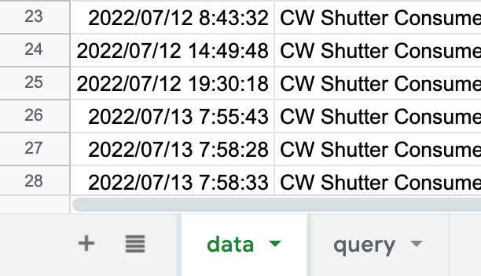
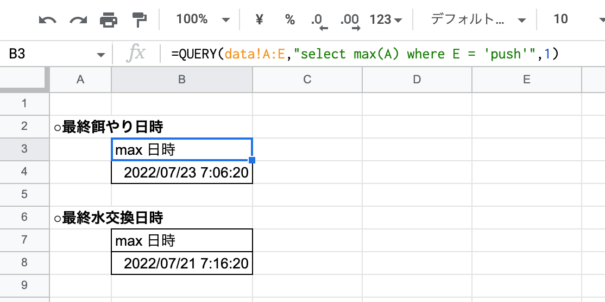

（編集中）

# 概要

Google App ScriptとGoogle Spread Sheetを用いて、無料で簡易的なWEBアプリケーション構築を実施。

WEBサイトはNetlifyでホスティングし、Google Spread Sheetの情報をGoogle Apps Scriptを利用して取得する。




完成した画面はこんな感じ



簡単に使い道の説明をすると、家事の一覧が表示され、前回いつ実施したかが表示されるダッシュボードである。今実施すべき家事は太字で表示され、実施期限が切れている家事は赤字で表示される仕様とした。


# クライアント側の開発

## 概要

html,css,javascriptで開発。
- デザインは、Bootstrapを活用
- 画面動作は、jQueryを活用
- サーバーへのアクセスはJavascrptのfetchを利用。

## ソースコード

html

```html
<!doctype html>
<html lang="ja">
<head>
    <!-- Required meta tags -->
    <meta charset="utf-8">
    <meta name="viewport" content="width=device-width, initial-scale=1">

    <!-- Bootstrap CSS -->
    <link href="https://cdn.jsdelivr.net/npm/bootstrap@5.0.2/dist/css/bootstrap.min.css" rel="stylesheet" integrity="sha384-EVSTQN3/azprG1Anm3QDgpJLIm9Nao0Yz1ztcQTwFspd3yD65VohhpuuCOmLASjC" crossorigin="anonymous">

    <!-- 共通CSS 読み込み-->
    <link rel="stylesheet" href="css/common.css">

    <!-- google font 導入-->
    <link rel="preconnect" href="https://fonts.googleapis.com">
    <link rel="preconnect" href="https://fonts.gstatic.com" crossorigin>
    <link href="https://fonts.googleapis.com/css2?family=Noto+Sans+JP&display   =swap" rel="stylesheet">

    <title>ゆきよしハウスレポート</title>

</head>
<body>

    <!-- ローディングアイコン -->
    <div id="loading">
        <div id="spinner" class="d-flex justify-content-center align-items-center">
    
        <div class="spinner-border text-primary" role="status">
            <span class="sr-only">Loading...</span>
        </div>
    
        </div>
    </div>

    <!-- メイン -->
    <div id="wrap">
        <!-- 現在日時 -->
        <div id="date_time" class="p-3 mb-2 bg-dark text-white">
            <div id="now" class="text-center">
                現在日時
            </div>
        </div>

        <!-- ＃＃＃＃＃＃＃＃はっぴー＃＃＃＃＃＃＃＃ -->
        <p class="text-light bg-dark" id="happy">
            【はっぴー】
        </p>
        <div class="mt-2">
            <!-- スペース用-->
        </div> 
        <!-- ○○○スコアボード○○○-->
        <div class="container">
            <div class="row">
                <div class="col mx-2 py-1 text-center border rounded">
                    <p class="my-0">えさやり</p>
                    <p class="my-0" id="latest_food_time"></p>
                </div>
                <div class="col mx-2 py-1 text-center border rounded">
                    <p class="my-0">現在の体重</p>
                    <p class="my-0" id="weight"></p>
                </div>
            </div>
        </div>
        <div class="mt-2">
            <!-- スペース用-->
        </div> 
        <div class="container">
            <div class="row">
                <div class="col mx-2 my-0 py-2 text-center border rounded">
                    <p class="my-0" id="exercise">運動量</p>
                </div>
            </div>
        </div>
        <!-- ○○○○○○○○ -->
        <div class="mt-2">
            <!-- スペース用-->
        </div> 
        <!-- ○○○表○○○ -->
        <div class = "mx-2">
            <table class="table table-bordered table-sm">
                <thead class="thead-dark">
                    <tr>
                        <th scope="col">▼項目</th>
                        <th scope="col">▼最終実施日</th>
                    </tr>
                </thead>
                <tbody>
                    <tr>
                        <td>水交換</td>
                        <td id="latest_water_time"></td>
                    </tr>
                    <tr>
                        <td>シャンプー</td>
                        <td id="shampoo"></td>
                    </tr>
                    <tr>
                        <td>体重測定</td>
                        <td id="latest_weight_measurement"></td>
                    <tr>
                        <td>足毛剃り</td>
                        <td id="latest_sole_trimmer"></td>
                    </tr>
                    <tr>
                        <td>爪切り（前）</td>
                        <td id="latest_nail_forefoot"></td>
                    </tr>
                    <tr>
                        <td>爪切り（後）</td>
                        <td id="latest_nail_hindfoot"></td>
                    </tr>
                </tbody>
            </table>
        </div>
        <!-- ○○○○○○○○ -->

        <!-- ＃＃＃＃＃＃＃＃おうち＃＃＃＃＃＃＃＃ -->
        <p class="text-light bg-dark">
            【おうち】
        </p>
        <div class="mt-2">
            <!-- スペース用-->
        </div> 
        <!-- ○○○スコアボード○○○-->
        <div class="container">
            <div class="row">
                <div class="col mx-2 py-0 text-center  border rounded">
                    <p class="my-1"><ins>リビング</ins></p>
                    <button type="button" class="btn" id="btn_living"></button>
                    <p class="my-0" id="living_temperature"></p>
                    <p class="my-0" id="living_humidity"></p>
                </div>
                <div class="col mx-2 py-0 text-center align-top border rounded">
                    <p class="my-1"><ins>和室</ins></p>
                    <button type="button" class="btn" id="btn_washitsu"></button>
                    <p class="my-0" id="washitsu_temperature"></p>
                    <p class="my-0"> -- ％ </p>
                </div>
            </div>
        </div>
    </div>


    <!-- jQuery slim 読み込み -->
    <script src="https://code.jquery.com/jquery-3.6.0.slim.js" integrity="sha256-HwWONEZrpuoh951cQD1ov2HUK5zA5DwJ1DNUXaM6FsY=" crossorigin="anonymous"></script>

    <!-- Optional JavaScript; choose one of the two! -->

    <!-- Option 1: Bootstrap Bundle with Popper -->
    <script src="https://cdn.jsdelivr.net/npm/bootstrap@5.0.2/dist/js/bootstrap.bundle.min.js" integrity="sha384-MrcW6ZMFYlzcLA8Nl+NtUVF0sA7MsXsP1UyJoMp4YLEuNSfAP+JcXn/tWtIaxVXM" crossorigin="anonymous"></script>

    <!-- Option 2: Separate Popper and Bootstrap JS -->
    <!--
    <script src="https://cdn.jsdelivr.net/npm/@popperjs/core@2.9.2/dist/umd/popper.min.js" integrity="sha384-IQsoLXl5PILFhosVNubq5LC7Qb9DXgDA9i+tQ8Zj3iwWAwPtgFTxbJ8NT4GN1R8p" crossorigin="anonymous"></script>
    <script src="https://cdn.jsdelivr.net/npm/bootstrap@5.0.2/dist/js/bootstrap.min.js" integrity="sha384-cVKIPhGWiC2Al4u+LWgxfKTRIcfu0JTxR+EQDz/bgldoEyl4H0zUF0QKbrJ0EcQF" crossorigin="anonymous"></script>
    -->

    <!-- JavaScript 読み込み-->
    <script src="js/common.js"></script>

</body>
</html>
```

css
```css
body {
    min-height: 100vh;
    /* mobile viewport bug fix */
    min-height: -webkit-fill-available;
}

html {
    height: -webkit-fill-available;
}

body{
    font-family: 'Noto Sans JP', sans-serif;
}

#title{
    font-size : 1.5em ;
}

#loading {
    display: none;
    position: fixed;
    width: 100%;
    height: 100%;
    top: 0px;
    left: 0px;
    background: #000;
    z-index: 1;
}

#spinner {
    display: none;
    color: #fff;
    z-index: 2;
}

#wrap{
    background: #fff;
    width: 100%;
}

```

javascript
```javascript

//ページ読み込み時に実行
$(document).ready( function(){

    const endpoint = "https://script.google.com/macros/s/AKfycbwncv1QPoO_nkfaJ29Nt9BfWc29P0CDdwWyIUFW04TagjogjoaAHUfAbHafoHX/exec";

    //ロードアイコン
    var h = $(window).height();
    $('#wrap').css('display','none');
    $('#loading ,#spinner').height(h).css('display','block');

    //APIを使って非同期データを取得する
    fetch(endpoint)
    .then(response => response.json())

    /*データ取得が成功した処理*/
    .then(json_data => {
        data_embedded(json_data);
    })
    .catch((e) => {
        console.log(e)  //エラーをキャッチし表示     
    })

});


function data_embedded(json_data){

    //型の調整
    const now = new Date(); //現在日時の取得
    const now_str = (Number(now.getMonth())+1) +"月"+now.getDate()+"日"+"（"+getYoubi(now)+"）"+now.getHours()+"時"+now.getMinutes()+"分"

    const latest_food_time = new Date(json_data.latest_food_time);
    const latest_food_str = (Number(latest_food_time.getMonth())+1)+"月"+latest_food_time.getDate()+"日"+" "+latest_food_time.getHours()+"時"

    const weight = json_data.weight;

    const exercise_today = json_data.exercise_today;
    const exercise_5days = json_data.exercise_5days;
    const exercise_str = "運動量"+"　"+"今日：" + exercise_today +"分"+"　"+"5日平均：" + json_data.exercise_5days+"分"

    const latest_water_time = new Date(json_data.latest_water_time); 
    const latest_water_str = (Number(latest_water_time.getMonth())+1) +"月"+latest_water_time.getDate()+"日"+"（"+getYoubi(latest_water_time)+"）"

    const latest_shampoo = new Date(json_data.latest_shampoo);
    const shampoo_str = (Number(latest_shampoo.getMonth())+1) +"月"+latest_shampoo.getDate()+"日"+"（"+getYoubi(latest_shampoo)+"）"

    const latest_weight_measurement = new Date(json_data.latest_weight_measurement);
    const weight_measurement_str = (Number(latest_weight_measurement.getMonth())+1) +"月"+latest_weight_measurement.getDate()+"日"+"（"+getYoubi(latest_weight_measurement)+"）"

    const latest_sole_trimmer = new Date(json_data.latest_sole_trimmer);
    const sole_trimmer_str = (Number(latest_sole_trimmer.getMonth())+1) +"月"+latest_sole_trimmer.getDate()+"日"+"（"+getYoubi(latest_sole_trimmer)+"）"

    const latest_nail_forefoot = new Date(json_data.latest_nail_forefoot);
    const nail_forefoot_str = (Number(latest_nail_forefoot.getMonth())+1) +"月"+latest_nail_forefoot.getDate()+"日"+"（"+getYoubi(latest_nail_forefoot)+"）"

    const latest_nail_hindfoot = new Date(json_data.latest_nail_hindfoot);
    const nail_hindfoot_str = (Number(latest_nail_hindfoot.getMonth())+1) +"月"+latest_nail_hindfoot.getDate()+"日"+"（"+getYoubi(latest_nail_hindfoot)+"）"

    const living_status_flg = json_data.living_status_flg;
    const washitsu_status_flg = json_data.washitsu_status_flg;

    const living_temperature = json_data.living_temperature;
    const living_humidity = json_data.living_humidity;
    const washitsu_temperature = json_data.washitsu_temperature;

    //経過時間の計算

    const progress_food_hours = orgRound((now - latest_food_time) / (60 * 60 * 1000),1);
    const progress_water_hours = orgRound((now - latest_water_time) / (60 * 60 * 1000),1);
    const progress_weight_hours = orgRound((now - latest_weight_measurement) / (60 * 60 * 1000),1);
    const progress_shampoo_hours = orgRound((now - latest_shampoo) / (60 * 60 * 1000),1);
    const progress_sole_trimmer_hours = orgRound((now - latest_sole_trimmer) / (60 * 60 * 1000),1);
    const progress_nail_forefoot_hours = orgRound((now - latest_nail_forefoot) / (60 * 60 * 1000),1);
    const progress_nail_hindfoot_hours = orgRound((now - latest_nail_hindfoot) / (60 * 60 * 1000),1);

    //データの表示ーーーーーーーーーーーーーーーーーーーーーーーーーーーーーーーーー

    //現在日時
    $('#now').text("現在日時"+"　"+ now_str);

    //餌やり
    $('#latest_food_time').text(latest_food_str);
    if(6 <= progress_food_hours && progress_food_hours <= 8){$('#latest_food_time').css('font-weight', 'bold');}
    else if(8 < progress_food_hours){$('#latest_food_time').css("color","red");}

    //体重
    $('#weight').text(weight + "kg");

    //運動量
    $('#exercise').text(exercise_str);
    if(exercise_today < 45){$('#exercise').css("color","red");}
    if(exercise_5days < 45){$('#exercise').css("color","red");}

    //水交換
    $('#latest_water_time').text(latest_water_str);
    if(36 <= progress_water_hours && progress_water_hours <= 60){$('#latest_water_time').css('font-weight', 'bold');}
    else if(60 < progress_water_hours){$('#latest_water_time').css("color","red");}

    //シャンプー
    $('#shampoo').text(shampoo_str);
    if(120 <= progress_shampoo_hours && progress_shampoo_hours <= 168){$('#shampoo').css('font-weight', 'bold');}
    else if(168 < progress_shampoo_hours){$('#shampoo').css("color","red");}

    //体重測定
    $('#latest_weight_measurement').text(weight_measurement_str);
    if(120 <= progress_weight_hours && progress_weight_hours <= 168){$('#latest_weight_measurement').css('font-weight', 'bold');}
    else if(168 < progress_weight_hours){$('#latest_weight_measurement').css("color","red");}
    
    //足の裏毛剃り
    $('#latest_sole_trimmer').text(sole_trimmer_str);
    if(456 <= progress_sole_trimmer_hours && progress_sole_trimmer_hours <= 720){$('#latest_sole_trimmer').css('font-weight', 'bold');}
    else if(720 < progress_sole_trimmer_hours){$('#latest_sole_trimmer').css("color","red");}

    //爪切り（前）
    $('#latest_nail_forefoot').text(nail_forefoot_str);
    if(456 <= progress_nail_forefoot_hours && progress_nail_forefoot_hours <= 720){$('#latest_nail_forefoot').css('font-weight', 'bold');}
    else if(720 < progress_nail_forefoot_hours){$('#latest_nail_forefoot').css("color","red");}

    //爪切り（後）
    $('#latest_nail_hindfoot').text(nail_hindfoot_str);
    if(456 <= progress_nail_hindfoot_hours && progress_nail_hindfoot_hours <= 720){$('#latest_nail_hindfoot').css('font-weight', 'bold');}
    else if(720 < progress_nail_hindfoot_hours){$('#latest_nail_hindfoot').css("color","red");}

    //リビング状態ボタン
    $('#btn_living').text(living_status_flg);
    if(living_status_flg == "free"){
        $('#btn_living').addClass('btn-outline-primary');
    }else{
        $('#btn_living').addClass('btn-outline-danger');
    }

    //和室状態ボタン
    $('#btn_washitsu').text(washitsu_status_flg);
    if(washitsu_status_flg == "free"){
        $('#btn_washitsu').addClass('btn-outline-primary');
    }else{
        $('#btn_washitsu').addClass('btn-outline-danger');
    }

    //リビング気温
    $('#living_temperature').text(living_temperature + "℃");
    if(28 <= living_temperature){$('#living_temperature').css("color","red");}
    else if(20 >= living_temperature){$('#living_temperature').css("color","blue");}

    //リビング湿度
    $('#living_humidity').text(living_humidity + "％");
    if( living_humidity < 40 || 60 < living_humidity ){$('#living_humidity').css("color","red");}

    //和室気温
    $('#washitsu_temperature').text(washitsu_temperature + "℃");
    if(28 <= washitsu_temperature){$('#washitsu_temperature').css("color","red");}
    else if(20 >= washitsu_temperature){$('#washitsu_temperature').css("color","blue");}

    //完了したら、ロードアイコンを閉じる
    $('#wrap').css('display','block');
    $('#loading').css('display','none');
    $('#spinner').css('display','none');

}


//四捨五入用
function orgRound(value, base) {
    return Math.round(value * base) / base;
}

//曜日取得用
function getYoubi(date){
    const youbi = ["日","月","火","水","木","金","土"];
    return(youbi[date.getDay()])    
}

//google form ページ遷移
$('#happy').on('click', function() {
    window.location.href = 'https://docs.google.com/forms/d/e/1FAIpQLSSIJFsY0Z-oXxBH9Rhp_59hagajgoaFPPGdSe2W70ZA/viewform';
});

//ボタンクリック時利用関数
const url_living_busy = "https://script.google.com/macros/s/AKfycbxxgcofsjijaStXyV_v6sQkILPYyHeOe6ufRiFOAJfojHpDWA/exec?room=リビング&status=busy"
const url_living_free = "https://script.google.com/macros/s/AKfycbxxgifsjofjcaStXyV_v6sQkILPYyHeOe6ufRiePAEvFuC8QyH5OFSVaJ0TOUCyUtUwTHpDWA/exec?room=リビング&status=free"
const url_washitsu_busy = "https://script.google.com/macros/s/AKfycbxxgcaStsdfkfskf6sQkILPYyHeOe6ufRiePAEvFuC8QyH5eBBEGJVFSIJFOIJyUtUwTHpDWA/exec?room=和室&status=busy"
const url_washitsu_free = "https://script.google.com/macros/s/AKfycbxxgcaStXyV_sdfssQkILPYyHeOe6ufRiePAEvFuC8QyH5eBBEGSDFJNSFJdnsdsjofjswTHpDWA/exec?room=和室&status=free"

//ボタンクリック（リビング）
$('#btn_living').on('click',function(){
    if($('#btn_living').text() == "free"){
        data_post(url_living_busy);
        $('#btn_living').text("busy");
        $('#btn_living').removeClass('btn-outline-primary');        
        $('#btn_living').addClass('btn-outline-danger');        
    }else{
        data_post(url_living_free);
        $('#btn_living').text("free");
        $('#btn_living').removeClass('btn-outline-danger');        
        $('#btn_living').addClass('btn-outline-primary'); 
    }
});

//ボタンクリック（和室）
$('#btn_washitsu').on('click',function(){
    if($('#btn_washitsu').text() == "free"){
        data_post(url_washitsu_busy);
        $('#btn_washitsu').text("busy");
        $('#btn_washitsu').removeClass('btn-outline-primary');        
        $('#btn_washitsu').addClass('btn-outline-danger');        
    }else{
        data_post(url_washitsu_free);
        $('#btn_washitsu').text("free");
        $('#btn_washitsu').removeClass('btn-outline-danger');        
        $('#btn_washitsu').addClass('btn-outline-primary'); 
    }
});

function data_post(url){
    location.href = url;        
};

```
## ホスティング

Netlifyを利用。
Netlifyにログインして、今回の"サイト"を作成する。
デプロイする際は、作成した"サイト"を開き、上部メニューから”Deploys”を選択。開いた画面にドラック＆ドロップでhtml,css.javascriptが入ったファイルを入れると自動的にホスティングされる。

（htmlの名前をindex.htmlにしていたため特に設定なくホスティングできたが、他の名称にしていたりフォルダの階層深くに置いたりしている場合は、設定が必要かもしれない）

# サーバ側の開発

## google spread sheet の開発

データ加工は、Google Spread Sheet上である程度完了させることをお勧めする。 

Google App Scriptから複雑にデータを引き出すクエリは打てない。また、Google Spread Sheet上ではQuery関数というSQLライクな関数を用いてデータを加工することも可能である。よって、google spread sheet上で加工が完了しており、google app scriptからは固定のセルに値を取りに行くだけというのが良いかと思う。


まず、以下のような形でデータ入っている"data"シートに加えて、データを加工するための"query"シートを追加する。


”query”シートでは、Query関数を用いて、sqlでdataシートの必要な値を取得している。


## Google App Script　の開発

### 概要

Google App Scriptにログインし、開発を行う。
必要なSpread Sheetへアクセスし、データを取得する。
WEBアプリとしてリリースすればOK。

### ソースコード

```javascript
//GETリクエスト時に呼び出される関数
function doGet(e) {

  //▼SHEET情報の設定--------------------------------------------------------------

  //IoT_button_A
  const SPREAD_SHEET_ID_IoT_button_A = '1DbkOzjZgagagap_l5ALO4JPOKFPA_v0o9CbwVKtaXQ';
  const SHEET_NAME_Iot_button_A = 'query';

  //部屋状態フラグ
  const SPREAD_SHEET_ID_room_status_flg = '1SupSJOFSJGOGNuus-AAFJfojX3XoiM1j6WZwhro';

  //BME280
  const SPREAD_SHEET_ID_bme280 = '1iNjsxJWTYIJOFGJSGSAxHXc23KgraNFNrDw';
  const SHEET_NAME_bme280 = 'query';

  //Nature Remo
  const SPREAD_SHEET_ID_nature_remo = '1LPYE4k1uagoia-giag-J58gsWrln-Lig';
  const SHEET_NAME_nature_remo = 'query';

  //アンケート
  const SPREAD_SHEET_ID_google_forms = '1eWZVU8Qx5H0asagcELA-cExFOjahgguf6PB4U';
  const SHEET_NAME_nature_google_forms = 'query';


  //▲SHEET情報の設定--------------------------------------------------------------

  //餌やり・水交換クラス
  class FeedData{

    constructor() {
      this.latest_food_time = '1990/01/01 00:00:00';
      this.latest_water_time = '1990/01/01 00:00:00'; 
    }

    getFeedData(){

      //スプレットシート情報の取得
      const sheet = SpreadsheetApp.openById(SPREAD_SHEET_ID_IoT_button_A).getSheetByName(SHEET_NAME_Iot_button_A);
      
      //データ取得
      this.latest_food_time = sheet.getRange('B4').getValue();
      this.latest_water_time = sheet.getRange('B8').getValue();
    
    }

  }

  //アンケート情報クラス
  class Google_forms{

    constructor(){
      this.latest_nail_forefoot = '1990/01/01 00:00:00'; 
      this.latest_nail_hindfoot = '1990/01/01 00:00:00';
      this.latest_sole_trimmer = '1990/01/01 00:00:00';
      this.latest_shampoo = '1990/01/01 00:00:00';
      this.latest_toy_wash = '1990/01/01 00:00:00';
      this.latest_medicine = '1990/01/01 00:00:00';
      this.exercise_today = 0;
      this.exercise_5days = 0;
      this.latest_weight_measurement = '1990/01/01 00:00:00'; 
      this.weight = 0;
    }

    getGoogleForms(){

      //スプレットシート情報の取得
      const sheet = SpreadsheetApp.openById(SPREAD_SHEET_ID_google_forms).getSheetByName(SHEET_NAME_nature_google_forms);
      
      //データ取得
      this.latest_nail_forefoot =  sheet.getRange('B4').getValue(); 
      this.latest_nail_hindfoot =  sheet.getRange('B8').getValue();
      this.latest_sole_trimmer =  sheet.getRange('B12').getValue();
      this.latest_shampoo =  sheet.getRange('B16').getValue();
      this.latest_toy_wash =  sheet.getRange('B20').getValue();
      this.latest_medicine =  sheet.getRange('B24').getValue();
      this.exercise_today =  sheet.getRange('D29').getValue();
      this.exercise_5days =  sheet.getRange('I29').getValue();
      this.latest_weight_measurement =  sheet.getRange('B33').getValue();
      this.weight =  sheet.getRange('D33').getValue();

    }

  }

  //部屋利用情報クラス
  class Room_status_flg{

    constructor(){
      this.washitsu_status_flg = 0; 
      this.living_status_flg = 0;
    }

    getRoomStatusFlg(){

      //スプレットシート情報の取得
      const sheet = SpreadsheetApp.openById(SPREAD_SHEET_ID_room_status_flg).getActiveSheet();
      
      //データ取得
      this.washitsu_status_flg = sheet.getRange('B2').getValue();
      this.living_status_flg = sheet.getRange('B3').getValue();

    }

  }

  //温湿度情報
  class Room_environment{

    constructor(){
      this.bme280_temperature = 0;
      this.bme280_humidity = 0; 
      this.nature_remo_temperature = 0;
    }

    getRoomEnvironmentData(){

      //スプレットシート情報の取得
      const sheet_bme280 = SpreadsheetApp.openById(SPREAD_SHEET_ID_bme280).getSheetByName(SHEET_NAME_bme280);
      
      //データ取得
      this.bme280_temperature = sheet_bme280.getRange('C8').getValue();
      this.bme280_humidity = sheet_bme280.getRange('C12').getValue();

      //スプレットシート情報の取得
      const sheet_nature_remo = SpreadsheetApp.openById(SPREAD_SHEET_ID_nature_remo).getSheetByName(SHEET_NAME_nature_remo);
      
      //データ取得
      this.nature_remo_temperature = sheet_nature_remo.getRange('B4').getValue();

    }

  }

  //＋＋＋＋＋＋＋＋＋＋＋＋＋＋＋＋＋＋＋＋＋＋＋＋＋＋＋＋＋＋＋＋＋＋＋＋＋＋＋＋＋＋＋＋＋＋＋＋＋＋＋＋＋＋＋＋＋＋＋


  var feed_data = new FeedData();  //餌やり情報のインスタンス化
  feed_data.getFeedData(); //餌やりデータをspread sheetから取得

  var google_forms = new Google_forms(); //google form 情報のインスタンス化
  google_forms.getGoogleForms() //google form 情報をspread sheetから取得

  var room_status_flg = new Room_status_flg(); //部屋情報のインスタンス化
  room_status_flg.getRoomStatusFlg(); //部屋情報データをspread sheetから取得

  var room_environment = new Room_environment(); //部屋環境のインスタンス化
  room_environment.getRoomEnvironmentData() //部屋環境データをspread sheetから取得


  //データ送付==================

  //jsonを作る
  const data = {
    latest_food_time: feed_data.latest_food_time,
    latest_water_time: feed_data.latest_water_time,
    weight: google_forms.weight,
    latest_weight_measurement:google_forms.latest_weight_measurement,
    exercise_today:google_forms.exercise_today,
    exercise_5days:google_forms.exercise_5days,
    latest_shampoo:google_forms.latest_shampoo,
    latest_sole_trimmer:google_forms.latest_sole_trimmer,
    latest_nail_forefoot:google_forms.latest_nail_forefoot,
    latest_nail_hindfoot:google_forms.latest_nail_hindfoot,
    living_status_flg:room_status_flg.living_status_flg,
    washitsu_status_flg:room_status_flg.washitsu_status_flg,
    living_temperature:room_environment.bme280_temperature,
    living_humidity:room_environment.bme280_humidity,
    washitsu_temperature:room_environment.nature_remo_temperature
  } 

  Logger.log(JSON.stringify(data));


  //返却情報を生成
  const result = ContentService.createTextOutput();

  //Mime TypeをJSONに設定
  result.setMimeType(ContentService.MimeType.JSON);

  //JSONテキストをセットする
  result.setContent(JSON.stringify(data));

  return result;
}


```


# 所感

簡易的ながらもシステムライクな構成が無料で実現できたのはとても良かった。

微妙だと思ったのは以下の点。
- サーバ側のレスポンスがあまり良くない
- Google App ScriptからのSpread Sheetのクエリは、やはりSQLを使えることが望ましい。Spread Sheet上でデータを加工すると、設計がわかりにくかったり、誤操作を招きやるかったりすると思うので、品質のボトルネックになっている印象。
- 今回は、Google App ScriptWEBエディタで開発。エラーが解決しにくいと感じる箇所が多かった。ログの見方がわかにくい。またバージョン管理がしにくいことも課題だが、どうやらそこはgit hubと連携できるようなので、次回試そうと思う。


