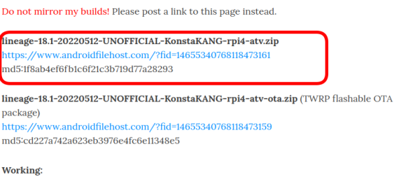

# 使用機器
・Raspberry Pi 4 
・キーボード、マウス、モニタが必要 
 

# 必要ファイルのダウンロード
以下の2つをダウンロード 
 
LineageOS 

|  https://konstakang.com/devices/rpi4/LineageOS18-ATV/ 
|  → Raspberry Pi Imager、Ether、ddなどでmicroSD に書き込む 

参考： 

 

open_gapps 

|  https://opengapps.org/?arch=arm64&api=11.0&variant=tvstock 
|  → USBメモリなどに配置

>2022年8月13日現在、LineageOS 19 Android TV(Android 12L) は存在するが、Android 12Lに対応したopen_gappsはまだ存在しない。そのためLineageOS 18 Android TV(Android 11)を使用する。 
 
 

# 起動
LineageOSを書き込んだmicroSDをRaspberryPiに挿入して起動。最初はBluetooth機器のペアリングをさせられる。[^1] 
手順（抜粋） 
Start → ... → Language：Englishのままで[^1] → ... → Select Your Wifi Network：Skip → ... 
大きく「Lineage」と表示されたら設定完了。右下の「Start」をクリック。 

> [^1]：周辺のBluetooth機器は電源OFFにした方が良いかも。ペアリング成功するまで先に進めないっぽい。

> [^2]：言語、ロケール、wifiの設定などは今行っても無意味なので飛ばす。AndroidTV起動後に行えば良い。

# 操作方法
|  キー  |  概要  |
| ---- | ---- |
|  F2  | 戻る |
 
 

# リカバリモードでLineageOSを再起動
## advanced restart options（リカバリモード）を有効にする 
Settings（右上の歯車）→  System →  Buttons →  Advanced reboot
## リカバリモードで再起動
System に戻る →  Reboot → Recovery
 
 

# OpenGAppsのインストール
Install → Select Storage → 先程USBに保存したopen_gapps-arm64-11.0-tvstock-xxxxxxxx.zipを選択 → Swipe to confirm Flash（マウスでスマホ風にスワイプする）→ 
インストール終了したら、Back →  Wipe →  Factory reset →  再起動 
再起動後はAndroid TVになっているはず。
 
 

# 資料
公式：https://konstakang.com/devices/rpi4/LineageOS18-ATV/ 
→ 特に「How to install Google apps?」の情報
